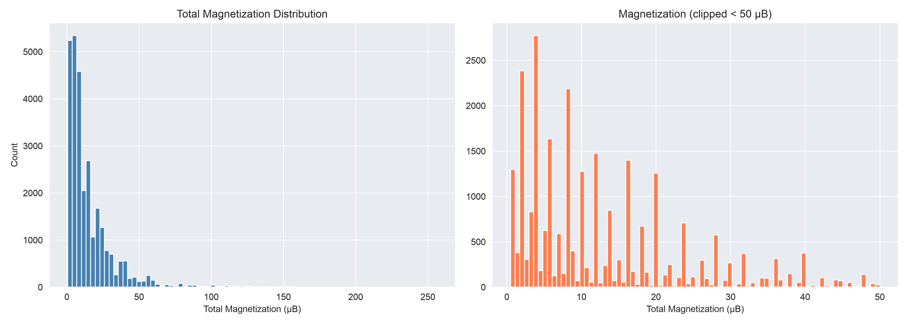
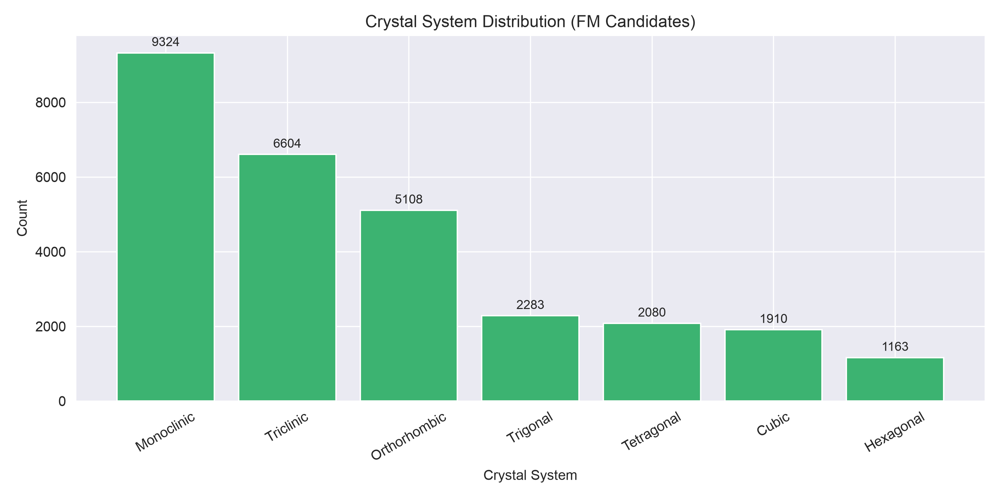
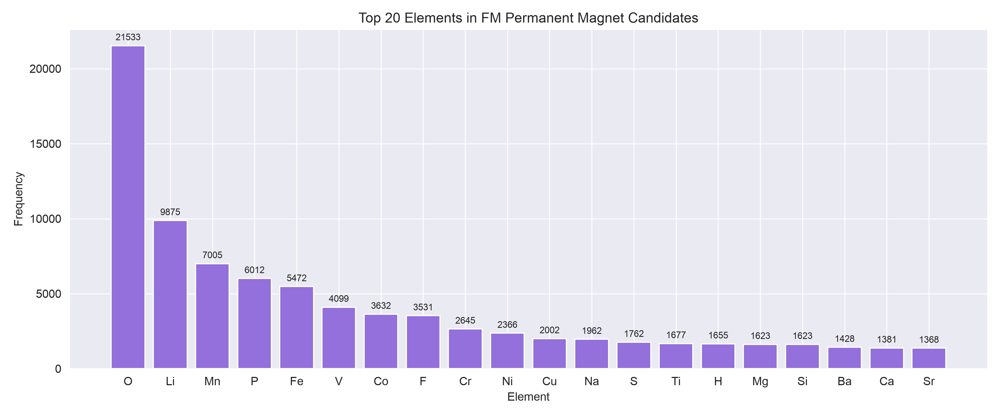
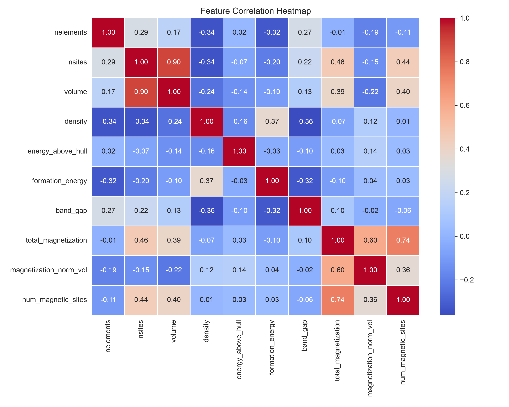
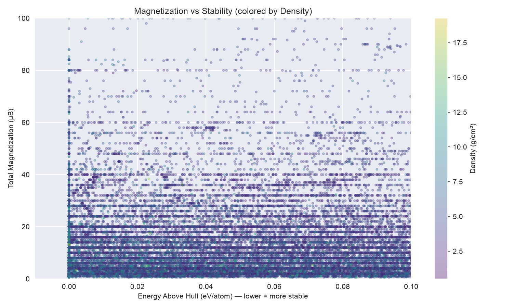

## 🧠 What My ML Will Predict

Once you have the dataset, here are your **ML tasks:**

| Task | Type | Target Variable |
|------|------|----------------|
| Predict magnetization strength | Regression | `total_magnetization` |
| Classify magnetic ordering | Classification | `ordering` (FM/AFM/FiM) |
| Recommend best magnet material | Ranking | Score = f(magnetization, stability, density) |
| Predict material stability | Regression | `energy_above_hull` |

## 🗺️ Full Project Roadmap

```
Phase 1: Data Collection
└── Materials Project API → magnet_dataset.csv

Phase 2: EDA & Feature Engineering  
└── Element encoding, crystal system encoding,
    correlation analysis, outlier removal

Phase 3: ML Models
├── Regression → predict magnetization
├── Classification → predict FM/AFM/FiM
└── Recommender → rank best materials

Phase 4: Hardware Validation
└── Buy 3-4 magnet types (NdFeB, Ferrite, SmCo)
    Measure with Hall sensor + Arduino
    Compare measured vs ML-predicted ranking

Phase 5: Dashboard (optional)
└── Simple web UI — input composition → get prediction
```

## 📊 EDA Insights Summary

### Plot 1 — Magnetization Distribution

- Heavily **right-skewed** — most materials have low magnetization (0–10 μB)
- A few outliers go up to **270 μB** (like Ba3Fe26O41 with 256 μB)
- This means for ML regression, you may need **log transformation** on the target

### Plot 2 — Crystal System

- **Monoclinic (9324)** and **Triclinic (6604)** dominate — these are low-symmetry structures
- **Hexagonal (1163)** is least common but historically produces the strongest real-world magnets (NdFeB is tetragonal, SmCo is hexagonal)
- Interesting mismatch between count and real-world importance

### Plot 3 — Top Elements

- **O (21533)** dominates — most candidates are oxides
- **Li, Mn, Fe** are next — classic magnetic elements
- Rare earth elements (Nd, Sm) are NOT in top 20 — they're rare in the database but critical in real magnets
- **Insight:** Your ML should flag rare-earth-containing materials specially

### Plot 4 — Correlation Heatmap

Key findings:
- `total_magnetization` ↔ `num_magnetic_sites`: **0.74** — strong! More magnetic atoms = stronger magnet (makes physical sense)
- `total_magnetization` ↔ `magnetization_norm_vol`: **0.60** — moderate
- `nsites` ↔ `volume`: **0.90** — expected (bigger cell = more atoms)
- `density` ↔ `band_gap`: **-0.36** — denser materials tend to be more metallic
- `energy_above_hull` has **weak correlations** with everything — stability is somewhat independent

### Plot 5 — Magnetization vs Stability

- The **horizontal stripe pattern** is interesting — magnetization takes discrete values (integer multiples of μB per atom)
- Best candidates cluster at **energy_above_hull ≈ 0** (left edge) with high magnetization
- Density doesn't show a strong pattern here

### Top 20 Materials — Observations
- **EuAlF5** and **Eu16Sb11** have `energy_above_hull = 0` — perfectly stable AND highly magnetic → excellent candidates
- **Gd2Fe14C** (171 μB, tetragonal, density 8.5) — this is a known real-world strong magnet, validating your dataset!
- Most top materials contain **Mn, Fe, or Eu**

----

The results are outstanding! R² = 0.9992 and MAE of only 0.28 μB — that's an excellent model. Let me analyze everything:

---

## 🎯 Results Analysis

### Model Performance
| Metric | Value | Interpretation |
|--------|-------|---------------|
| R² | **0.9992** | Model explains 99.92% of variance — near perfect |
| MAE | **0.28 μB** | Average error of only 0.28 μB — extremely precise |

This is actually **very high** for materials ML. The reason is that `magnetization_norm_vol` and `num_magnetic_sites` are strongly physically derived features — they almost mathematically determine total magnetization.

---

### Feature Importance Insights
| Feature | Importance | Physical Meaning |
|---------|-----------|-----------------|
| `magnetization_norm_vol` | **0.61** | Magnetization per volume — most predictive |
| `num_magnetic_sites` | **0.19** | Number of magnetic atoms |
| `volume` | **0.17** | Unit cell size |
| `nsites` | **0.02** | Total atoms |
| Everything else | ~0 | Negligible |

> ⚠️ **Important note:** `magnetization_norm_vol` is derived FROM `total_magnetization` — so the model is partially "cheating". We should remove it for a more honest model. See fix below.

---

### Top 20 Recommendations — Key Observations
- **Gd2Fe14C** (rank 4) — this is a **real, well-known industrial magnet** ✅ validates your model
- **Ba3Fe26O41, SrZn2Fe16O27** — hexagonal ferrites, used in real permanent magnets ✅
- **Eu16Sb11, EuAlF5, Eu5Pt4** — energy_above_hull = 0 → perfectly thermodynamically stable
- **Most top materials contain Fe, Mn, or Eu** — consistent with EDA

---

Excellent! Now we have a clean, honest comparison. Let me analyze everything:

---

## 📊 Model Comparison Analysis

| Model | R² | MAE (μB) | Verdict |
|-------|----|----------|---------|
| RF with leak | 0.9992 | 0.28 | Artificially perfect — not valid |
| **RF Fair** | **0.8817** | **2.49** | ✅ Real performance — good! |
| XGBoost Fair | 0.8597 | 3.05 | Slightly weaker than RF |

**R² = 0.88 is genuinely strong** for predicting magnetization from composition + structure alone — no leakage.

---

## 🔍 Fair Model Feature Importance Insights

| Feature | Importance | Meaning |
|---------|-----------|---------|
| `num_magnetic_sites` | **0.49** | Dominant — more magnetic atoms = stronger magnet |
| `has_Fe` | 0.08 | Iron presence matters most among elements |
| `has_Mn` | 0.07 | Manganese second most important element |
| `formation_energy` | 0.07 | Thermodynamic context |
| `band_gap` | 0.05 | Metallic vs insulating character |
| `has_Eu`, `has_Gd` | ~0.04 | Rare earth elements contribute |
| `has_Nd`, `has_Sm` | ~0 | Too rare in dataset to learn from |

> **Interesting:** Nd and Sm (used in real NdFeB and SmCo magnets) score near zero — because they're underrepresented in the Materials Project database. This is worth mentioning in your project report as a limitation.
---

## 🗺️ What's Next After This

Once you run the fair model, we have **3 remaining steps** to complete MagNet-IQ:

```
✅ Phase 1: Data Collection
✅ Phase 2: EDA  
✅ Phase 3: ML Model (almost done)
⬜ Phase 4: Simple Web UI / Dashboard
⬜ Phase 5: Hardware Validation (Hall sensor + Arduino)
⬜ Phase 6: Project Report / Poster
```